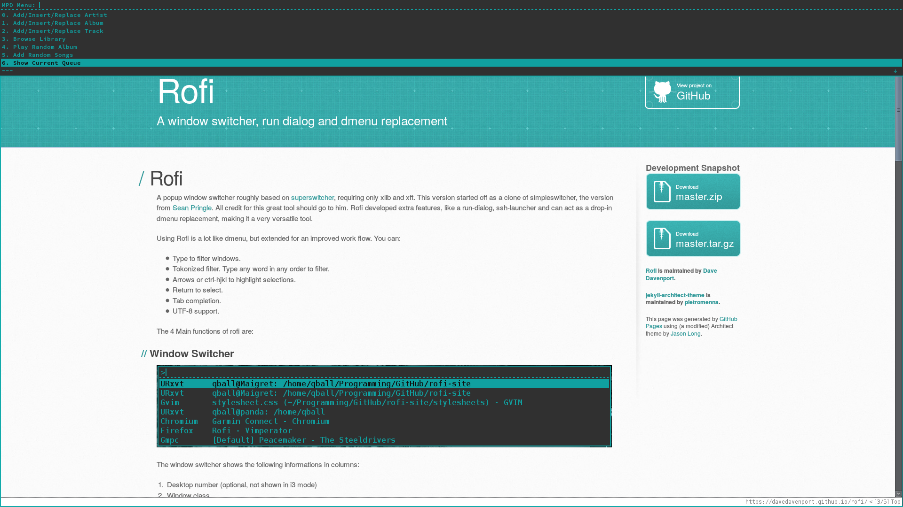
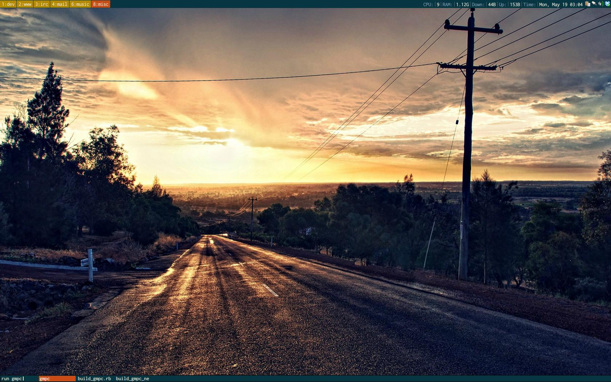
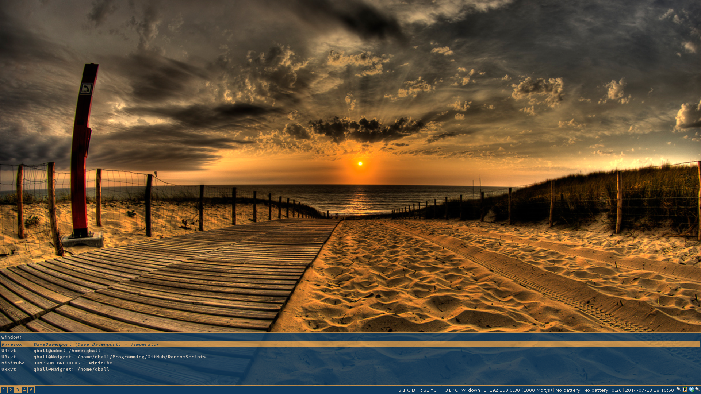

This place lists a set of nice setups for rofi.
You can easily get your current configuration by typing:

    rofi -dump-xresources

## Dropdown menu

Xresources file:

        rofi.opacity: 90
        rofi.width: 50
        rofi.lines: 5
        rofi.columns: 1
        rofi.font: SourceCodePro-9
        rofi.fg: #1aa
        rofi.bg: #333
        rofi.hlfg: #333
        rofi.hlbg: #1aa
        rofi.bc: #1aa
        rofi.bw: 2
        rofi.loc: 0
        rofi.padding: 2
        rofi.yoffset: -2
        rofi.xoffset: 0
        rofi.fixed-num-lines: false
        rofi.hmode: false
        rofi.terminal: x-terminal-emulator
        rofi.ssh-set-title: true
        rofi.key: F12
        rofi.rkey: mod1+F2
        rofi.skey: mod1+F3

## DMenu mode: Well hidden

Xresources entries:

        rofi.background: #073642
        rofi.foreground: #eee8d5
        rofi.highlightbg: #b58900
        rofi.highlightfg: #ffffff
        rofi.bordercolor: #678698
        rofi.padding: 1
        rofi.lines: 10
        rofi.borderwidth: 1
        rofi.opacity: 100
        rofi.font: Inconsolata:pixelsize=16
        rofi.location: 7
        rofi.yoffset: 0
        rofi.xoffset: 0
        rofi.width: 100
        rofi.fixed_num_lines: 1
        rofi.hmode: false
        rofi.terminal: st
        rofi.ssh-set-title: false

## Pop-pup Mode

Xresources entries:

        rofi.opacity: 85
        rofi.width: 1924
        rofi.lines: 7
        rofi.columns: 4
        rofi.font: SourceCodePro-9
        rofi.fg: #E5DBCF
        rofi.bg: #0F3B5F
        rofi.hlfg: #0F3B5F
        rofi.hlbg: #CC9752
        rofi.bc: #CC9752
        rofi.bw: 2
        rofi.loc: 6
        rofi.padding: 2
        rofi.yoffset: -22
        rofi.xoffset: 0
        rofi.fixed-num-lines: true
        rofi.hmode: false
        rofi.terminal: x-terminal-emulator
        rofi.ssh-set-title: true
        rofi.disable-history: true
        rofi.key: F12
        rofi.rkey: mod1+F2
        rofi.skey: mod1+F3

