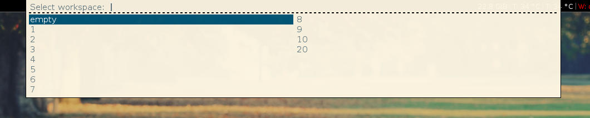
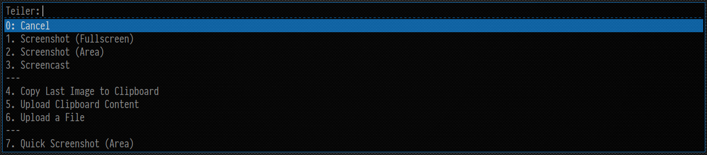
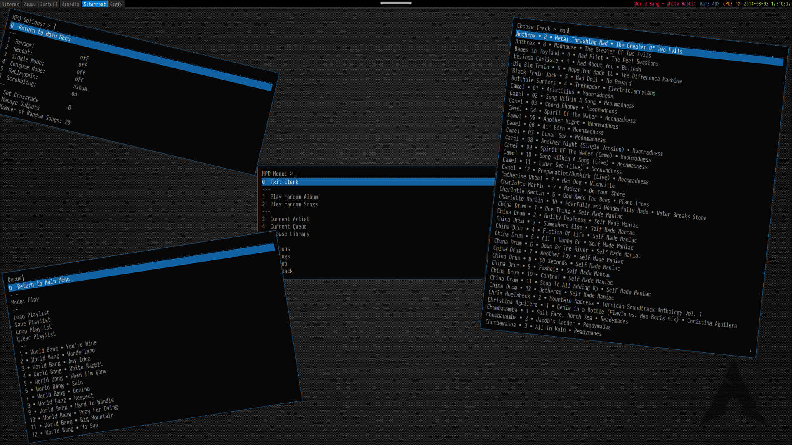

This page lists a set of useful scripts that uses Rofi.

## I3 Workspace selector

The script can be found
[here](https://github.com/DaveDavenport/RandomScripts/blob/master/i3_switch_workspace.sh).
(It also uses another script, `i3_empty_workspace.sh` from the same repository.)

## teiler

with teiler you can create screenshots and screencasts easily.
powered by rofi, scrot and ffmpeg it offers the following features:
Screenshots (fullscreen, windows, area - with and without delays)
Screencasts
Uploading images and videos to a remote server.
* [filebin](http://git.server-speed.net/users/flo/filebin/)
* openssh
* imgur (only images)
* amazon s3

teiler in addition can
* copy the last image to clipboard
* keep a history of your screenshots

## clerk

[clerk](https://github.com/carnager/clerk) is a mpd client using mpc, mppc [see here](https://github.com/carnager/mppc) and rofi.

It offers the usual features.
* Simple playlist management.
* Library Browser (in various ways)
* play random albums/tracks
* Lookup and play albums/tracks by currently playing artist.
* Set all major mpd options (random, consume, single, repeat, replaygain, crossfade, etc...)
* Playback Controls.

It also offers unique features like rating of albums or tracks in a 100% portable way
All options are available as command line arguments, to make it easy to associate hotkeys with most used features.

