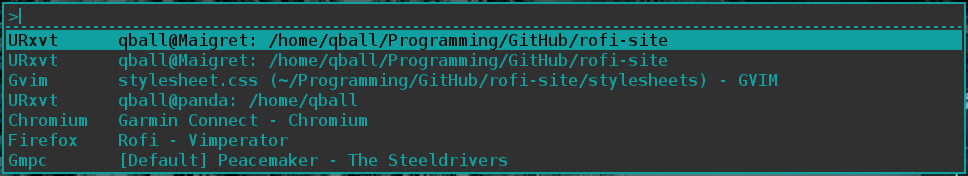
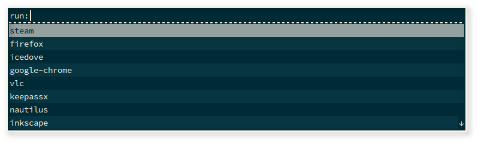
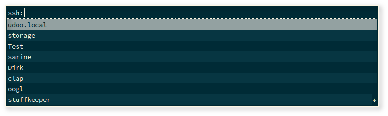
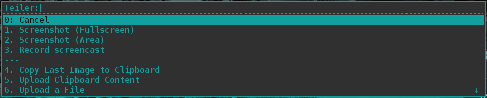

A popup window switcher roughly based on [superswitcher](http://code.google.com/p/superswitcher/), requiring only xlib and xft.
This version started off as a clone of simpleswitcher, the version from [Sean
Pringle](http://github.com/seanpringle/simpleswitcher). All credit for this great tool should go to him.
Rofi developed extra features, like a run-dialog, ssh-launcher and can act as a drop-in dmenu
replacement, making it a very versatile tool.

Using Rofi is a lot like dmenu, but extended for an improved work flow. You can: 

* Type to filter windows.
* Tokenized filter. Type any word in any order to filter.
* Arrows or ctrl-hjkl to highlight selections.
* Return to select.
* Tab completion.
* UTF-8 support.

For the run and ssh modi:

* History based ordering last 25 choices are ordered on top based on use. (optional)
* Levenshtein distance ordering of matches. (optional)

The 4 Main functions of rofi are:

## Window Switcher

The window switcher shows the following informations in columns:

1. Desktop number (optional, not shown in i3 mode)
2. Window class.
3. Window title.

If compiled with I3 support, it should autodetect if I3 window manager is running and switch into 
I3 compatibility mode. This will disable Desktop numbers and hide the i3-bar, also it sends an IPC
message to I3 to change focus.

## Run dialog

The run dialog allows the user to quickly search and launch a program.
It offers the following features:

  - Shift-Return to run the selected program in a terminal.
  - Favorites list, frequently used programs are sorted on top.

## SSH launcher

Quickly ssh into remote machines

  - Parses ~/.ssh/config to find hosts.

## dmenu replacement

Drop in dmenu replacement. (Screenshot shows rofi used by
[teiler](https://github.com/carnager/teiler) ).

# Usage

e.g. a one-shot launch:

  rofi -now -font "snap-10" -fg "#505050" -bg "#000000" -hlfg "#ffb964" -hlbg "#000000" -o 85

or run it as a daemon that sits in the background waiting for the hotkey 'F12':

  rofi -key F12

## Switching Between Modi

Type '?' (enter)  to switch from Window list mode to Run mode and back.

# Compilation

If compiling from GIT, first run to generate the needed build files:

    autoreconf --install

To build rofi, run the following steps:

    mkdir build/
    cd build/
    ../configure
    make
    make install

The build system will autodetect the i3 header file during compilation. If it fails, make sure you 
have i3/ipc.h installed. Check config.log for more information. 

# Dependencies

Rofi requires the following tools and libraries to be installed:

 * libx11
 * libxinerama
 * libxdg-basedir
 * libxft 

# Configuration

There are 3 ways to configure rofi:

## 1. Pre-compile time

You can change the default behavior by modifying config/config.c

## 2. Xresources

Another solution is to configure it via X resources, e.g. add the following to your 
Xresources file:

    rofi.background: #333
    rofi.foreground: #1aa
    rofi.highlightbg: #1aa
    rofi.highlightfg: #111
    rofi.bordercolor: #277
    rofi.font: times 10
    rofi.padding: 3
    rofi.lines: 5
    rofi.borderwidth: 3

## 3. Runtime

All the above settings can be overridden by rofi's commandline flags.
See the [manpage](manpage.html).

# Archlinux

This version of rofi has been made available on the
[AUR](https://aur.archlinux.org/packages/rofi-git/).

# Contact

Issues, feature requests can be filed at the github [issue
tracker](https://github.com/DaveDavenport/rofi/issues). Please read the *reporting bugs* section
below.

If you need to ask a direct question or get support installing, please find us on IRC: #gmpc on
[freenode.net](https://webchat.freenode.net/?channels=#gmpc).

# Reporting Bugs

When reporting bugs keep in mind that the people working on it do this unpaid, in their free time
and as a hobby. So be polite and helpful. Bug reports that *demand*, contain *insults* to this
or other projects, or have a general unfriendly tone will be closed without discussion. Everybody
has it own way of working; What might be the *norm* for you, might not be for others. 
