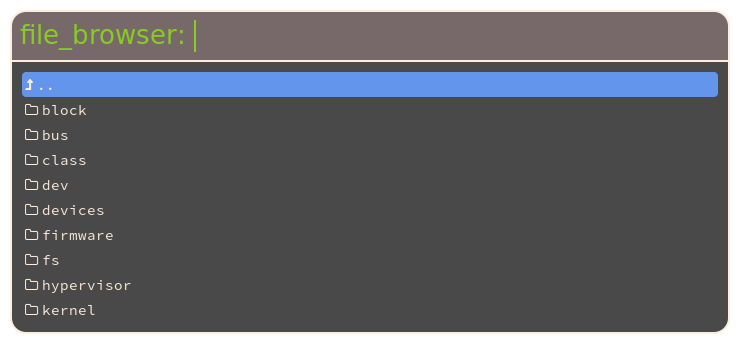

> This guide is taken from the 1.4.0 release preview posts. The information
> might be outdated, but in general should still be correct and a good starting
> point for writing a plugin. Links have been updated. A recent plugin that can
> be used as example can be found [here](https://git.sr.ht/~qball/rofi-ntfy).

## Build system

**Rofi** uses [autotools](https://en.wikipedia.org/wiki/GNU_build_system) as
build system. While there are many opinions about the pre/cons off all the
different options out there (to many to go into in this blog post), we will
stick to [autotools](https://en.wikipedia.org/wiki/GNU_build_system) for now.

To make life easier I create a template project
[here](https://github.com/davatorium/rofi-plugin-template)

This includes the 2 files for the build system and the C template.

### Configure.ac

First we are going to update the `configure.ac` file:

```text
AC_INIT([rofi-plugin-template], [0.0.1],
[https://my-neat-plugin.org//],[],[https://support.my-neat-plugin.org/])

AC_CONFIG_HEADER([config.h])

AC_CONFIG_MACRO_DIRS([m4])
AM_INIT_AUTOMAKE([-Wall -Werror foreign subdir-objects dist-xz])
AM_SILENT_RULES([yes])

AC_PROG_CC([clang gcc cc])
AC_PROG_CC_C99
AM_PROG_CC_C_O

AC_USE_SYSTEM_EXTENSIONS

AM_PROG_AR

AM_CFLAGS="-Wall -Wextra -Wparentheses -Winline -pedantic  -Wunreachable-code"

PKG_PROG_PKG_CONFIG

PKG_CHECK_MODULES([glib],     [glib-2.0 >= 2.40 gio-unix-2.0 gmodule-2.0 ])
PKG_CHECK_MODULES([rofi],     [rofi])

[rofi_PLUGIN_INSTALL_DIR]="`$PKG_CONFIG --variable=pluginsdir rofi`"
AC_SUBST([rofi_PLUGIN_INSTALL_DIR])

LT_INIT([disable-static])

AC_SUBST([AM_CFLAGS])


AC_CONFIG_FILES([Makefile ])
AC_OUTPUT
```

Basically the only thing here we need to change is the name of the plugin, the
website and the support site.

```diff
AC_INIT([rofi-file-browser], [0.0.1], [https://davedavenport.github.io/rofi/],[],[https://reddit.org/r/qtools/])
```

### Makefile.am

We need to make a similar change in the `Makefile.am` file, this is important so
each plugin has a unique name. (if they are all called myplugin, it would be
hard to install more then one plugin.)

```text
ACLOCAL_AMFLAGS=-I m4
plugindir=@rofi_PLUGIN_INSTALL_DIR@

plugin_LTLIBRARIES = myplugin.la

myplugin_la_SOURCES=\
		 src/myplugin.c

myplugin_la_CFLAGS= @glib_CFLAGS@ @rofi_CFLAGS@
myplugin_la_LIBADD= @glib_LIBS@ @rofi_LIBS@
myplugin_la_LDFLAGS= -module -avoid-version
```

So we do a search and replace from `myplugin` to `file_browser`:

```text
ACLOCAL_AMFLAGS=-I m4
plugindir=${libdir}/rofi/

plugin_LTLIBRARIES = file_browser.la

file_browser_la_SOURCES=\
		 src/file_browser.c

file_browser_la_CFLAGS= @glib_CFLAGS@ @rofi_CFLAGS@
file_browser_la_LIBADD= @glib_LIBS@ @rofi_LIBS@
file_browser_la_LDFLAGS= -module -avoid-version
```

As you noticed I also changed the name of the c template file. This is not
needed.

## Building the system

Now that we have this setup, it is easy to build:

- Generate the build system:

```bash
autoreconf -i
```

- Create a `build` directory.

```bash
mkdir build
cd build
```

- Run `configure` 

```bash
../configure
```

- build

```bash
make
```
- install

```bash
make install
```

You can now test the plugin by calling:

```bash
rofi -show myplugin -modi myplugin
```

If we start changing the template, the name to use will change.

## Edit the C template

The first thing todo is personalize the template. Below I have modified it so
it is called file-browser:

```c
/**
 * rofi-file-browser
 *
 * MIT/X11 License
 * Copyright (c) 2017 Qball Cow <qball@gmpclient.org>
 *
 * Permission is hereby granted, free of charge, to any person obtaining
 * a copy of this software and associated documentation files (the
 * "Software"), to deal in the Software without restriction, including
 * without limitation the rights to use, copy, modify, merge, publish,
 * distribute, sublicense, and/or sell copies of the Software, and to
 * permit persons to whom the Software is furnished to do so, subject to
 * the following conditions:
 *
 * The above copyright notice and this permission notice shall be
 * included in all copies or substantial portions of the Software.
 *
 * THE SOFTWARE IS PROVIDED "AS IS", WITHOUT WARRANTY OF ANY KIND, EXPRESS
 * OR IMPLIED, INCLUDING BUT NOT LIMITED TO THE WARRANTIES OF
 * MERCHANTABILITY, FITNESS FOR A PARTICULAR PURPOSE AND NONINFRINGEMENT.
 * IN NO EVENT SHALL THE AUTHORS OR COPYRIGHT HOLDERS BE LIABLE FOR ANY
 * CLAIM, DAMAGES OR OTHER LIABILITY, WHETHER IN AN ACTION OF CONTRACT,
 * TORT OR OTHERWISE, ARISING FROM, OUT OF OR IN CONNECTION WITH THE
 * SOFTWARE OR THE USE OR OTHER DEALINGS IN THE SOFTWARE.
 */
#include <stdlib.h>
#include <stdio.h>
#include <unistd.h>
#include <string.h>
#include <errno.h>
#include <gmodule.h>

#include <rofi/mode.h>
#include <rofi/helper.h>
#include <rofi/mode-private.h>

#include <stdint.h>

G_MODULE_EXPORT Mode mode;

/**
 * The internal data structure holding the private data of the TEST Mode.
 */
typedef struct
{
    char **array;
    unsigned int array_length;
} FileBrowserModePrivateData;


static void get_file_browser (  Mode *sw )
{
    /**
     * Get the entries to display.
     * this gets called on plugin initialization.
     */
}


static int file_browser_mode_init ( Mode *sw )
{
    /**
     * Called on startup when enabled (in modi list)
     */
    if ( mode_get_private_data ( sw ) == NULL ) {
        FileBrowserModePrivateData *pd = g_malloc0 ( sizeof ( *pd ) );
        mode_set_private_data ( sw, (void *) pd );
        // Load content.
        get_file_browser ( sw );
    }
    return TRUE;
}
static unsigned int file_browser_mode_get_num_entries ( const Mode *sw )
{
    const FileBrowserModePrivateData *pd = (const FileBrowserModePrivateData *) mode_get_private_data ( sw );
    return pd->array_length;
}

static ModeMode file_browser_mode_result ( Mode *sw, int mretv, char **input, unsigned int selected_line )
{
    ModeMode           retv  = MODE_EXIT;
    FileBrowserModePrivateData *pd = (FileBrowserModePrivateData *) mode_get_private_data ( sw );
    if ( mretv & MENU_NEXT ) {
        retv = NEXT_DIALOG;
    } else if ( mretv & MENU_PREVIOUS ) {
        retv = PREVIOUS_DIALOG;
    } else if ( mretv & MENU_QUICK_SWITCH ) {
        retv = ( mretv & MENU_LOWER_MASK );
    } else if ( ( mretv & MENU_OK ) ) {
        retv = RELOAD_DIALOG;
    } else if ( ( mretv & MENU_ENTRY_DELETE ) == MENU_ENTRY_DELETE ) {
        retv = RELOAD_DIALOG;
    }
    return retv;
}

static void file_browser_mode_destroy ( Mode *sw )
{
    FileBrowserModePrivateData *pd = (FileBrowserModePrivateData *) mode_get_private_data ( sw );
    if ( pd != NULL ) {
        g_free ( pd );
        mode_set_private_data ( sw, NULL );
    }
}

static char *_get_display_value ( const Mode *sw, unsigned int selected_line, G_GNUC_UNUSED int *state, G_GNUC_UNUSED GList **attr_list, int get_entry )
{
    FileBrowserModePrivateData *pd = (FileBrowserModePrivateData *) mode_get_private_data ( sw );
    // Only return the string if requested, otherwise only set state.
    return get_entry ? g_strdup("n/a"): NULL;
}

static int file_browser_token_match ( const Mode *sw, GRegex **tokens, unsigned int index )
{
    FileBrowserModePrivateData *pd = (FileBrowserModePrivateData *) mode_get_private_data ( sw );
    // Call default matching function.
    return helper_token_match ( tokens, pd->array[index]);
}

Mode mode =
{
    .abi_version        = ABI_VERSION,
    .name               = "file_browser",
    .cfg_name_key       = "display-file_browser",
    ._init              = file_browser_mode_init,
    ._get_num_entries   = file_browser_mode_get_num_entries,
    ._result            = file_browser_mode_result,
    ._destroy           = file_browser_mode_destroy,
    ._token_match       = file_browser_token_match,
    ._get_display_value = _get_display_value,
    ._get_message       = NULL,
    ._get_completion    = NULL,
    ._preprocess_input  = NULL,
    .private_data       = NULL,
    .free               = NULL,
};
```

If we now rebuild the plugin, we need to run the following command:

```bash
rofi -show file_browser -modi file_browser
```
### The mode description 

The mode is defined by the `Mode` structure, every mode in rofi has one of the
plugins.

```c
Mode mode =
{
    .abi_version        = ABI_VERSION,
    .name               = "file_browser",
    .cfg_name_key       = "display-file_browser",
    ._init              = file_browser_mode_init,
    ._get_num_entries   = file_browser_mode_get_num_entries,
    ._result            = file_browser_mode_result,
    ._destroy           = file_browser_mode_destroy,
    ._token_match       = file_browser_token_match,
    ._get_display_value = _get_display_value,
    ._get_message       = NULL,
    ._get_completion    = NULL,
    ._preprocess_input  = NULL,
    .private_data       = NULL,
    .free               = NULL,
};
```

The ABI_VERSION is defined in **rofi** header file, so that **rofi** can detect
what ABI the plugin was compiled against. Not every function needs to be
implemented, in the plugin we show the minimum set.

Lets modify each of the above functions to implement something useful.

### FileBrowserModePrivateData

This is a structure that holds all the private data of this mode.
We are going to extend this so it can hold the state of information we want to
view.

We want to differentiate between 3 different rows:

- Go one level up
- Directory
- Regular file

So we add an enum:

```c
enum FBFileType {                                                         
    UP,                                                                   
    DIRECTORY,                                                            
    RFILE,                                                                
};                                                                        
```

We need a structure that hold each entry.

-   It should have a **name** we are going to show the user. This will hold an
    `utf-8` string. (rofi will only display utf-8). 

-   It should hold the **path** to the entry. This will be in the file-systems
    encoding.

-   The type it holds.

```c
typedef struct {                                                          
    char *name;                                                           
    char *path;                                                           
    enum FBFileType type;                                                 
} FBFile;                                                                 
```

Then in the *private* data we hold all the relevant information. 

- The current directory to show.
- Array of all the *FBFile* we want to show.
- The length of the array.

```c                                                                          
typedef struct                                                            
{                                                                         
    GFile *current_dir;                                                   
    FBFile *array;                                                        
    unsigned int array_length;                                            
} FileBrowserModePrivateData;                                             
```

###  Initialization

Now that we have the data structure to hold our information, we need to
initialize it and fill it.

```c
static int file_browser_mode_init ( Mode *sw )                        
{                                                                     
    if ( mode_get_private_data ( sw ) == NULL ) {                     
        FileBrowserModePrivateData *pd = g_malloc0 ( sizeof ( *pd ) );
        mode_set_private_data ( sw, (void *) pd );                    
        pd->current_dir = g_file_new_for_path(g_get_home_dir () );    
        get_file_browser ( sw );                                      
    }                                                                 
    return TRUE;                                                      
}                                                                     
```

The function first checked if we already initialized the private data. You can
include a mode multiple times, and we normally don't want it initialized
multiple times.

We then create a, zero initialized,  `FileBrowserModePrivateData` structure and
set this on the mode. Set the current directory to the users home directory and
call `get_file_browser` that will load in the entries. We will discuss this one
later.

### Destroying

On shutdown we want to cleanup, so there is also a destroy function.

```c
static void file_browser_mode_destroy ( Mode *sw )                                              
{                                                                                               
    FileBrowserModePrivateData *pd = (FileBrowserModePrivateData *) mode_get_private_data ( sw );
    if ( pd != NULL ) {                                                                         
        g_object_unref ( pd->current_dir );                                                     
        free_list ( pd );                                                                       
        g_free ( pd );                                                                          
        mode_set_private_data ( sw, NULL );                                                     
    }                                                                                           
}                                                                                               
```

This does the exact opposite.

For completeness:

```c
static void free_list ( FileBrowserModePrivateData *pd )
{
    for ( unsigned int i = 0; i < pd->array_length; i++ ) {
        FBFile *fb = & ( pd->array[i] );
        g_free ( fb->name );
        g_free ( fb->path );
    }
    g_free (pd->array);
    pd->array  = NULL;
    pd->array_length = 0;
}
```

### Loading the entries

Lets dive deeper into the `get_file_browser` function.

```c
static void get_file_browser (  Mode *sw )
{
    FileBrowserModePrivateData *pd = (FileBrowserModePrivateData *) mode_get_private_data ( sw );
```
We want to get access to the private data structure.

```c
    char *cdir = g_file_get_path ( pd->current_dir );
    DIR *dir = opendir ( cdir );
    if ( dir ) {
        struct dirent *rd = NULL;
        while ((rd = readdir (dir)) != NULL )
        {
```

We open the directory and we iterate over each entry. We then want to skip over
hidden files (starting with a .) and insert a special up node for going up one
directory.  For this  we do not need a path, and we show ".." to the user.

```c 
            if ( g_strcmp0 ( rd->d_name, ".." ) == 0 ){
                    pd->array = g_realloc ( pd->array, (pd->array_length+1)*sizeof(FBFile));
                    pd->array[pd->array_length].name = g_strdup ( ".." );
                    pd->array[pd->array_length].path = NULL;
                    pd->array[pd->array_length].type = UP;
                    pd->array_length++;
                    continue;

            } else if ( rd->d_name[0] == '.' ) {
                continue;
            }
```

We do a similar filtering act for the rest of the files, we skip `fifo`, `blk`,`character` and `socket` files.

```c
            switch ( rd->d_type )
            {
                case DT_BLK:
                case DT_CHR:
                case DT_FIFO:
                case DT_UNKNOWN:
                case DT_SOCK:
                    break;
                case DT_REG:
                case DT_DIR:
                    pd->array = g_realloc ( pd->array, (pd->array_length+1)*sizeof(FBFile));
                    pd->array[pd->array_length].name = g_strdup ( rd->d_name );
                    pd->array[pd->array_length].path = g_build_filename ( pd->current_dir, rd->d_name, NULL );
                    pd->array[pd->array_length].type = (rd->d_type == DT_DIR)? DIRECTORY: RFILE;
                    pd->array_length++; 
            }
        }
        closedir ( dir );
    }
```

We then sort the list in a way the user expects this.

```c
    g_qsort_with_data ( pd->array, pd->array_length, sizeof (FBFile ), compare, NULL );
}
```

Qsort here uses the following sort function:

```c
static gint compare ( gconstpointer a, gconstpointer b, gpointer data )
{
    FBFile *fa = (FBFile*)a;
    FBFile *fb = (FBFile*)b;
    if ( fa->type != fb->type ){
        return (fa->type - fb->type);
    }

    return g_strcmp0 ( fa->name, fb->name );
}
```

## Showing the entries

When showing each entry, rofi calls the `_get_display_value` function.  It calls
them in two situations, to get the state and the display string. Or just to get
the new state. If you need to return a string (should always be malloced), the
`get_entry` parameter is set to 1.

We currently show the name, and prepend an icon using the Awesome Font.

```c
static char *_get_display_value ( const Mode *sw, unsigned int selected_line, G_GNUC_UNUSED int *state, G_GNUC_UNUSED GList **attr_list, int get_entry )
{
    FileBrowserModePrivateData *pd = (FileBrowserModePrivateData *) mode_get_private_data ( sw );

    // Only return the string if requested, otherwise only set state.
    if ( !get_entry ) return NULL;
    if ( pd->array[selected_line].type == DIRECTORY ){
        return g_strdup_printf ( " %s", pd->array[selected_line].name);
    } else if ( pd->array[selected_line].type == UP ){
        return g_strdup( " ..");
    } else {
        return g_strdup_printf ( " %s", pd->array[selected_line].name);
    }
    return g_strdup("n/a"); 
}
```

The `selected_line` setting will always be within range 0 and the result of
`.get_num_entries`.

```c
static unsigned int file_browser_mode_get_num_entries ( const Mode *sw )
{
    const FileBrowserModePrivateData *pd = (const FileBrowserModePrivateData *) mode_get_private_data ( sw );
    return pd->array_length;
}
```

> The `attr_list` argument is there for more advanced markup of the string.

## Filtering the entries

When filtering we want to filter on the file name, we luckily store this entry
in `FBFile::name`. To use **rofi**'s matching algorithm we can use the
`helper_token_match` function.

```c
static int file_browser_token_match ( const Mode *sw, GRegex **tokens, unsigned int index )
{
    FileBrowserModePrivateData *pd = (FileBrowserModePrivateData *) mode_get_private_data ( sw );

    // Call default matching function.
    return helper_token_match ( tokens, pd->array[index].name);
}
```

The `index` setting will always be within range 0 and the result of
`.get_num_entries`.

## Running it

Now we should be able to build it, install it and run it and see the result.

```bash
rofi -show file_browser -modi file_browser
```



## Handling selected entries 

This is just an example and can probably be implemented nicer.
Here it also shows some rudimentary parts in **rofi**, that show some of the
ugly details, that will be cleaned up in the future.

```c

static ModeMode file_browser_mode_result ( Mode *sw, int mretv, char **input, unsigned int selected_line )
{
    ModeMode           retv  = MODE_EXIT;
    FileBrowserModePrivateData *pd = (FileBrowserModePrivateData *) mode_get_private_data ( sw );
    if ( mretv & MENU_NEXT ) {
        retv = NEXT_DIALOG;
    } else if ( mretv & MENU_PREVIOUS ) {
        retv = PREVIOUS_DIALOG;
    } else if ( mretv & MENU_QUICK_SWITCH ) {
        retv = ( mretv & MENU_LOWER_MASK );
```

This is the user pressing `enter` on the entry. We handle it differently for
each type.

```c
    } else if ( ( mretv & MENU_OK ) ) {
        if ( selected_line < pd->array_length )
        {
            if ( pd->array[selected_line].type == UP ) {
                GFile *new = g_file_get_parent ( pd->current_dir );
               if ( new ){
                   g_object_unref ( pd->current_dir );
                   pd->current_dir = new;
                   free_list (pd);
                   get_file_browser ( sw );
                   return RESET_DIALOG;
               }
            } else if ( pd->array[selected_line].type == DIRECTORY ) {
                GFile *new = g_file_new_for_path ( pd->array[selected_line].path );
                g_object_unref ( pd->current_dir );
                pd->current_dir = new;
                free_list (pd);
                get_file_browser ( sw );
                return RESET_DIALOG;
            } else if ( pd->array[selected_line].type == RFILE ) {
                char *d = g_strescape ( pd->array[selected_line].path,NULL );
                char *cmd = g_strdup_printf("xdg-open '%s'", d );
                g_free(d);
                char *cdir = g_file_get_path ( pd->current_dir );
                helper_execute_command ( cdir,cmd, FALSE );
                g_free ( cdir );
                g_free ( cmd );
                return MODE_EXIT;
            }
        }
        retv = RELOAD_DIALOG;
```

Handle custom entry that does not match an entry:

```c
    } else if ( (mretv&MENU_CUSTOM_INPUT) && *input ) {
        char *p = rofi_expand_path ( *input );
        char *dir = g_filename_from_utf8 ( p, -1, NULL, NULL, NULL );
        g_free (p);
        if ( g_file_test ( dir, G_FILE_TEST_EXISTS )  )
        {
            if ( g_file_test ( dir, G_FILE_TEST_IS_DIR ) ){
                g_object_unref ( pd->current_dir );
                pd->current_dir = g_file_new_for_path ( dir );
                g_free ( dir );
                free_list (pd);
                get_file_browser ( sw );
                return RESET_DIALOG;
            }

        }
        g_free ( dir );
        retv = RELOAD_DIALOG;
```

We do not support `delete`, just reload.
```c
    } else if ( ( mretv & MENU_ENTRY_DELETE ) == MENU_ENTRY_DELETE ) {
        retv = RELOAD_DIALOG;
    }
    return retv;
}
```

The `RESET_DIALOG` will clear the input bar and reload the view, `RELOAD_DIALOG`
will reload the view and re-filter based on the current text. 

> Note: `rofi_expand_path` will expand `~` and `~me/` into it full absolute
> path. Note: `helper_execute_command` will spawn command. 
