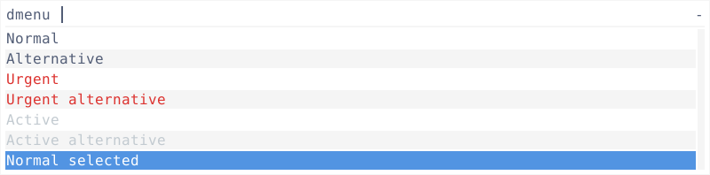
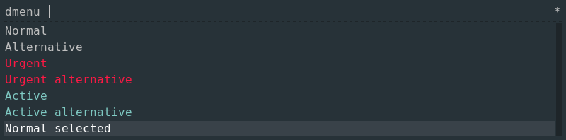
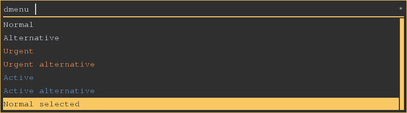
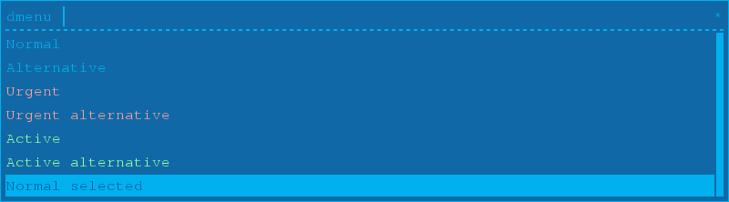
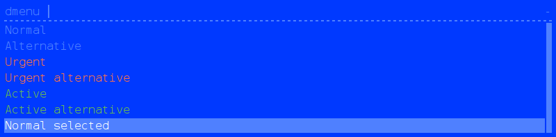
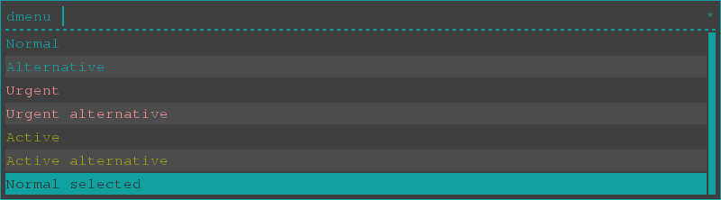
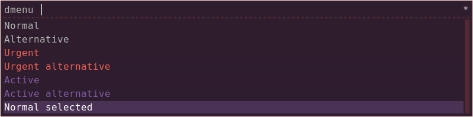
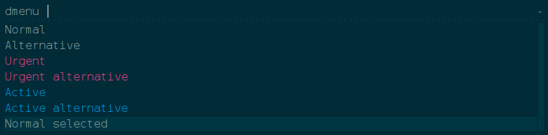
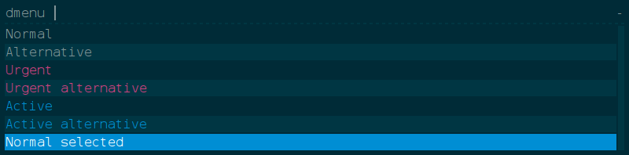

# Rofi Themes: 

# Arc

## Screenshot

## XResources

~~~
! ------------------------------------------------------------------------------
! ROFI Color theme
! ------------------------------------------------------------------------------
! Use extended color scheme
rofi.color-enabled:                  true
! Color scheme for normal row
rofi.color-normal:                   #ffffff,#525d76,#f5f5f5,#5294e2,#ffffff
! Color scheme for urgent row
rofi.color-urgent:                   #ffffff,#dc322f,#f5f5f5,#5294e2,#dc322f
! Color scheme for active row
rofi.color-active:                   #ffffff,#c2cad0,#f5f5f5,#5294e2,#c2cad0
! Color scheme window
rofi.color-window:                   #ffffff,#f5f5f5
! Separator style (none, dash, solid)
rofi.separator-style:                solid
~~~
# android_notification

## Screenshot

## XResources

~~~
! ------------------------------------------------------------------------------
! ROFI Color theme
! ------------------------------------------------------------------------------
rofi.color-enabled: true
rofi.color-window: #273238, #273238, #1e2529
rofi.color-normal: #273238, #c1c1c1, #273238, #394249, #ffffff
rofi.color-active: #273238, #80cbc4, #273238, #394249, #80cbc4
rofi.color-urgent: #273238, #ff1844, #273238, #394249, #ff1844
~~~
# blor

## Screenshot

## XResources

~~~
! ------------------------------------------------------------------------------
! ROFI Color theme
! ------------------------------------------------------------------------------
! Use extended color scheme
rofi.color-enabled:                  true
! Color scheme for normal row
rofi.color-normal:                   argb:00000000,  #D8DEE9 , argb:00000000,  #FAC863 ,  #1B2B34
! Color scheme for urgent row
rofi.color-urgent:                   argb:00000000,  #F99157 , argb:00000000,  #F99157 ,  #1B2B34
! Color scheme for active row
rofi.color-active:                   argb:00000000,  #6699CC , argb:00000000,  #6699CC ,  #1B2B34
! Color scheme window
rofi.color-window:                   argb:ee222222,  #FAC863 ,  #FAC863
! Separator style (none, dash, solid)
rofi.separator-style:                solid
~~~
# blue

## Screenshot

## XResources

~~~
! ------------------------------------------------------------------------------
! ROFI Color theme
! ------------------------------------------------------------------------------
! Use extended color scheme
rofi.color-enabled:                  true
! Color scheme for normal row
rofi.color-normal:                   argb:00000000, #00b0ef, argb:00000000, #00b0ef,#0060a0
! Color scheme for urgent row
rofi.color-urgent:                   argb:00000000, #ffa0a0, argb:00000000, #ffa0a0,#0060a0
! Color scheme for active row
rofi.color-active:                   argb:00000000, #a0ffa0, argb:00000000, #a0ffa0,#0060a0
! Color scheme window
rofi.color-window:                   argb:ee0060a0, #00b0ef,#00b0ef
~~~
# c64

## Screenshot

## XResources

~~~
! ------------------------------------------------------------------------------
! ROFI Color theme
! ------------------------------------------------------------------------------
rofi.color-enabled: true
rofi.color-window: #0039ff, #0039ff, #4F80FF
rofi.color-normal: #0039ff, #4f80ff, #0039ff, #4f80ff, #ffffff
rofi.color-active: #0039ff, #68ba50, #0039ff, #4f80ff, #68ba50
rofi.color-urgent: #0039ff, #ff7047, #0039ff, #4f80ff, #ff7047
~~~
# glue_pro_blue

## Screenshot

## XResources

~~~
! ------------------------------------------------------------------------------
! ROFI Color theme
! ------------------------------------------------------------------------------
rofi.color-enabled: true
rofi.color-window: #393939, #393939, #268bd2
rofi.color-normal: #393939, #ffffff, #393939, #268bd2, #ffffff
rofi.color-active: #393939, #268bd2, #393939, #268bd2, #205171
rofi.color-urgent: #393939, #f3843d, #393939, #268bd2, #ffc39c
~~~
# lb

## Screenshot

## XResources

~~~
! ------------------------------------------------------------------------------
! ROFI Color theme
! ------------------------------------------------------------------------------

! Use extended color scheme
rofi.color-enabled:                  true
! Color scheme for normal row
rofi.color-normal:                   argb:00000000, #1aa, argb:11FFFFFF, #1aa,#333
! Color scheme for urgent row
rofi.color-urgent:                   argb:00000000, #f99, argb:11FFFFFF, #f99,#333
! Color scheme for active row
rofi.color-active:                   argb:00000000, #aa1, argb:11FFFFFF, #aa1,#333
! Color scheme window
rofi.color-window:                   argb:ee333333, #1aa,#1aa
! Separator style (none, dash, solid)
rofi.separator-style:                dash
~~~
# purple

## Screenshot

## XResources

~~~
! ------------------------------------------------------------------------------
! ROFI Color theme
! ------------------------------------------------------------------------------
! Use extended color scheme
rofi.color-enabled:                  true
! Color scheme for normal row
rofi.color-normal:                   argb:a02f1e2e, #b4b4b4, argb:a02f1e2e, argb:54815ba4, #ffffff
! Color scheme for urgent row
rofi.color-urgent:                   argb:272f1e2e, #ef6155, argb:2f2f1e2e, argb:54815ba4, #ef6155
! Color scheme for active row
rofi.color-active:                   argb:272f1e2e, #815ba4, argb:2f2f1e2e, argb:54815ba4, #815ba4
! Color scheme window
rofi.color-window:                   #2f1e2e, argb:36ef6155, argb:2fef6155
! Separator style (none, dash, solid)
rofi.separator-style:                dash
~~~
# solarized

## Screenshot

## XResources

~~~
! ------------------------------------------------------------------------------
! ROFI Color theme
! ------------------------------------------------------------------------------
rofi.color-enabled: true
rofi.color-window: #002b37, #002b37, #003642
rofi.color-normal: #002b37, #819396, #002b37, #003642, #819396
rofi.color-active: #002b37, #008ed4, #002b37, #003642, #008ed4
rofi.color-urgent: #002b37, #da4281, #002b37, #003642, #da4281
~~~
# solarized_alternate

## Screenshot

## XResources

~~~
rofi.color-enabled: true
rofi.color-window: #002b37, #002b37, #003642
rofi.color-normal: #002b37, #819396, #003643, #008ed4, #ffffff
rofi.color-active: #002b37, #008ed4, #003643, #008ed4, #66c6ff
rofi.color-urgent: #002b37, #da4281, #003643, #008ed4, #890661
~~~
